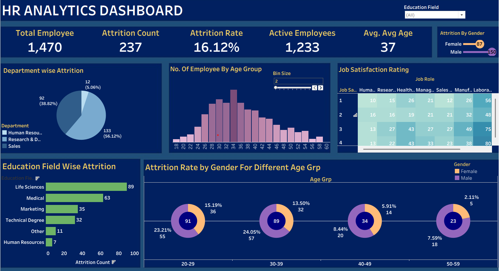

🧑‍💼 HR Attrition Analysis

📌 Objective  
The goal of this project was to analyze HR employee data to identify the factors influencing attrition and provide actionable insights for retention strategies.  
An interactive Tableau dashboard was created to visualize key HR metrics and attrition patterns.

📊 Dashboard Preview  

📊 Dataset  
- HR_Employee_Attrition.xlsx – Employee demographics, job satisfaction, performance, and attrition data  

🛠️ Tools Used  
- **Excel** → Data cleaning, preprocessing, and summaries  
- **Tableau** → Dashboard creation and visual analysis  

🔍 Key Insights  
- Younger employees (25–35 age group) showed the highest attrition.  
- Employees with **low job satisfaction** and poor **work-life balance** had higher turnover.  
- **Sales and R&D departments** recorded the highest attrition compared to HR.  
- Lower monthly income and fewer years at the company were strong indicators of attrition.  

📈 Dashboard  
The Tableau dashboard (HR_Attrition_Dashboard.twbx) contains:  
- Attrition rate overview by department and age group  
- Job satisfaction and work-life balance analysis  
- Salary and years-at-company correlation with attrition  
- Demographic distribution of employees  

📬 Next Steps  
- Expand dataset with additional HR factors (training, promotions, performance reviews).  
- Automate Tableau dashboard refresh using live HR data.  
- Integrate predictive modeling in Python/SQL for attrition forecasting.  
